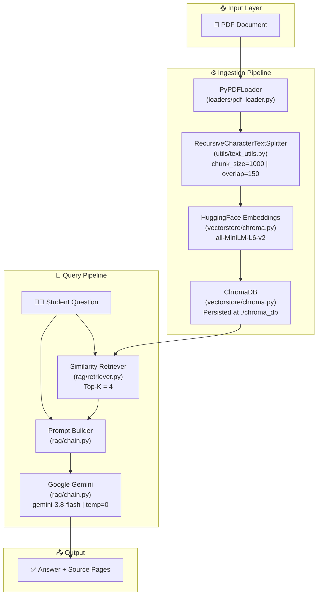

<div align="center">

# 🎓 CourseMate AI — RAG-Powered Study Assistant

**Ask questions. Get answers. Straight from your study material.**

[](https://python.org)
[](https://langchain.com)
[](https://ai.google.dev)
[](https://trychroma.com)
[](https://huggingface.co)
[](LICENSE)

<br/>

> *"Don't just read your textbook — talk to it."*

</div>

---

## 📖 Table of Contents

- [✨ What is CourseMate AI?](#-what-is-coursemate-ai)
- [🚀 How It Works](#-how-it-works)
- [🏗️ Architecture](#️-architecture)
- [📁 Project Structure](#-project-structure)
- [⚙️ Tech Stack](#️-tech-stack)
- [🛠️ Getting Started](#️-getting-started)
  - [Prerequisites](#prerequisites)
  - [Installation](#installation)
  - [Environment Setup](#environment-setup)
  - [Running the App](#running-the-app)
- [💬 Usage Example](#-usage-example)
- [🔧 Configuration](#-configuration)
- [🧩 Module Breakdown](#-module-breakdown)
- [🗺️ Roadmap](#️-roadmap)
- [🤝 Contributing](#-contributing)
- [📄 License](#-license)

---

## ✨ What is CourseMate AI?

**CourseMate AI** is an intelligent, RAG-powered (**Retrieval-Augmented Generation**) study assistant that lets students **have a conversation with their own study material**. Upload any PDF textbook, lecture notes, or course document — and CourseMate will answer your questions using *only* the content from that material, complete with source page references.

### 🎯 Key Highlights

| Feature | Description |
|---|---|
| 📚 **PDF Ingestion** | Loads and parses any PDF document automatically |
| 🔍 **Semantic Search** | Finds the most relevant passages using vector similarity |
| 🤖 **Gemini-Powered Answers** | Uses Google Gemini to generate accurate, student-friendly responses |
| 📌 **Source Citations** | Every answer includes the exact page numbers from the source document |
| 🚫 **Hallucination-Free** | Strictly answers from the provided study material only |
| 💾 **Persistent Vector Store** | ChromaDB persists embeddings — no re-processing on every run |

---

## 🚀 How It Works

CourseMate AI implements the **RAG (Retrieval-Augmented Generation)** pattern — a proven technique that grounds AI answers in real, verifiable source documents.

```
┌─────────────────────────────────────────────────────────────────┐
│                     ⚙️  INGESTION PIPELINE                      │
│                                                                 │
│  📄 PDF File                                                    │
│       │                                                         │
│       ▼                                                         │
│  [1] PyPDFLoader ──► Extracts raw text (page by page)          │
│       │                                                         │
│       ▼                                                         │
│  [2] Text Splitter ──► Splits into 1000-char chunks            │
│       │                 (150-char overlap for context)          │
│       ▼                                                         │
│  [3] HuggingFace Embeddings ──► Converts text → vectors        │
│       │                  (all-MiniLM-L6-v2)                    │
│       ▼                                                         │
│  [4] ChromaDB ──► Stores vectors on disk (./chroma_db)         │
│                                                                 │
├─────────────────────────────────────────────────────────────────┤
│                     💬  QUERY PIPELINE                          │
│                                                                 │
│  💬 User Question                                               │
│       │                                                         │
│       ▼                                                         │
│  [5] Retriever ──► Finds top-4 most relevant chunks            │
│       │                                                         │
│       ▼                                                         │
│  [6] Prompt Builder ──► Injects context + question             │
│       │                                                         │
│       ▼                                                         │
│  [7] Gemini LLM ──► Generates a grounded, cited answer         │
│       │                                                         │
│       ▼                                                         │
│  ✅  Answer + Source Pages                                      │
└─────────────────────────────────────────────────────────────────┘
```

---

## 🏗️ Architecture



---

## 📁 Project Structure

```
CourseMate AI Using RAG/
│
├── 📁 backend/                      # Core application (Python)
│   │
│   ├── 📁 app/                      # Main application package
│   │   ├── __init__.py
│   │   ├── config.py                # App-level configuration (extendable)
│   │   ├── main.py                  # 🚀 Entry point — full RAG pipeline
│   │   │
│   │   ├── 📁 loaders/              # Document ingestion
│   │   │   ├── __init__.py
│   │   │   └── pdf_loader.py        # PyPDFLoader wrapper
│   │   │
│   │   ├── 📁 utils/                # Shared utilities
│   │   │   ├── __init__.py
│   │   │   └── text_utils.py        # RecursiveCharacterTextSplitter
│   │   │
│   │   ├── 📁 embeddings/           # Embedding model abstraction
│   │   │   ├── __init__.py
│   │   │   └── embedding_model.py   # Google Gemini Embeddings (alt model)
│   │   │
│   │   ├── 📁 vectorstore/          # Vector database layer
│   │   │   ├── __init__.py
│   │   │   └── chroma.py            # ChromaDB creation & persistence
│   │   │
│   │   └── 📁 rag/                  # RAG core logic
│   │       ├── __init__.py
│   │       ├── retriever.py         # Similarity search retriever
│   │       └── chain.py             # Prompt builder + Gemini LLM chain
│   │
│   ├── 📁 data/
│   │   └── 📁 documents/            # 📂 Drop your PDF files here
│   │       └── Rich-Dad-Poor-Dad-2.pdf
│   │
│   ├── 📁 chroma_db/                # 💾 Persisted vector store (auto-generated)
│   ├── 📁 venv/                     # Python virtual environment
│   ├── .env                         # 🔑 API keys (never commit!)
│   ├── .gitignore
│   ├── requirements.txt             # Python dependencies
│   └── README.md
│
└── 📁 frontend/                     # 🚧 Frontend (coming soon)
```

---

## ⚙️ Tech Stack

| Layer | Technology | Purpose |
|---|---|---|
| **Language** | Python 3.9+ | Core programming language |
| **AI Framework** | LangChain | Orchestrates the full RAG pipeline |
| **LLM** | Google Gemini (`gemini-3.8-flash`) | Answer generation |
| **Embeddings** | HuggingFace `all-MiniLM-L6-v2` | Text → vector conversion |
| **Alt Embeddings** | Google Gemini Embeddings (`gemini-embedding-001`) | Alternative embedding model |
| **Vector DB** | ChromaDB | Local vector storage & similarity search |
| **PDF Parsing** | PyPDF + LangChain Community | Document loading |
| **Text Splitting** | LangChain `RecursiveCharacterTextSplitter` | Intelligent chunking |
| **Config** | `python-dotenv` | Secure environment variable management |

---

## 🛠️ Getting Started

### Prerequisites

Before you begin, ensure you have the following installed:

- ✅ **Python 3.9+** — [Download here](https://python.org/downloads)
- ✅ **pip** — comes bundled with Python
- ✅ **A Google API Key** — [Get one free at Google AI Studio](https://aistudio.google.com/apikey)

---

### Installation

**1. Clone the repository**

```bash
git clone https://github.com/your-username/CourseMate-AI-Using-RAG.git
cd "CourseMate-AI-Using-RAG/backend"
```

**2. Create and activate a virtual environment**

```bash
# Windows
python -m venv venv
venv\Scripts\activate

# macOS / Linux
python3 -m venv venv
source venv/bin/activate
```

**3. Install all dependencies**

```bash
pip install -r requirements.txt
```

> **Note:** The first run will also download the `all-MiniLM-L6-v2` sentence-transformer model (~90MB) from HuggingFace. This is cached locally after the first download.

---

### Environment Setup

Create a `.env` file inside the `backend/` directory:

```env
# backend/.env
GOOGLE_API_KEY="your_google_api_key_here"
```

> ⚠️ **Never commit your `.env` file!** It is already listed in `.gitignore`.

**How to get your Google API Key:**
1. Visit [Google AI Studio](https://aistudio.google.com/apikey)
2. Click **"Create API Key"**
3. Copy the key and paste it into your `.env` file

---

### Running the App

**Step 1 — Add your PDF document**

Place any PDF file inside `backend/data/documents/`:

```
backend/data/documents/your-study-material.pdf
```

**Step 2 — Update the PDF path in `main.py`** *(if using a different file)*

```python
# backend/app/main.py — line 13
PDF_PATH = "data/documents/your-study-material.pdf"
```

**Step 3 — Launch CourseMate AI**

```bash
# Ensure you are inside the backend/ directory
cd backend
python -m app.main
```

**Step 4 — Start asking questions!**

```
Loading PDF...
Loaded 207 pages.
Creating chunks...
Created 843 chunks.
Creating vector database...
Creating embeddings for 843 chunks...
Vector store created successfully.
Vector database ready.

CourseMate AI is ready!
Type 'exit' to quit.

You: ▌
```

---

## 💬 Usage Example

```
You: What is the difference between an asset and a liability?

CourseMate:
According to the study material, Robert Kiyosaki defines the key
difference very simply:

• An ASSET puts money INTO your pocket.
• A LIABILITY takes money OUT of your pocket.

The rich focus on acquiring assets — businesses, real estate,
stocks, and intellectual property — while the poor and middle
class tend to accumulate liabilities they mistakenly call assets,
such as their primary home.

Sources:
- Page 58
- Page 61
- Page 74
- Page 89

You: How does financial education relate to wealth?

CourseMate:
The study material emphasizes that financial education is the
foundation of wealth. The "poor dad" mindset focuses on job
security and a paycheck, while the "rich dad" mindset focuses
on acquiring financial knowledge and building assets...

Sources:
- Page 12
- Page 24
- Page 37

You: exit
```

---

## 🔧 Configuration

You can tune the RAG pipeline by modifying these parameters:

### Text Splitter — `utils/text_utils.py`

```python
splitter = RecursiveCharacterTextSplitter(
    chunk_size=1000,    # Characters per chunk
    chunk_overlap=150   # Overlap between consecutive chunks
)
```

| Parameter | Default | Effect |
|---|---|---|
| `chunk_size` | `1000` | Larger = more context per chunk, fewer chunks overall |
| `chunk_overlap` | `150` | Higher = better context continuity at chunk boundaries |

---

### Retriever — `rag/retriever.py`

```python
retriever = vector_store.as_retriever(
    search_type="similarity",   # Options: "similarity", "mmr"
    search_kwargs={"k": 4}      # Number of chunks retrieved per query
)
```

| Parameter | Default | Effect |
|---|---|---|
| `k` | `4` | More chunks = richer context but slightly slower response |
| `search_type` | `"similarity"` | `"mmr"` adds diversity to prevent redundant results |

---

### LLM — `rag/chain.py`

```python
llm = ChatGoogleGenerativeAI(
    model="gemini-3.8-flash",
    temperature=0   # 0 = fully deterministic, factual answers
)
```

| Parameter | Default | Effect |
|---|---|---|
| `temperature` | `0` | Increase for more creative answers; keep at 0 for factual study use |
| `model` | `gemini-3.8-flash` | Swap with `gemini-1.5-pro` for stronger reasoning capability |

---

## 🧩 Module Breakdown

### `app/loaders/pdf_loader.py`
Wraps LangChain's `PyPDFLoader` to extract text from PDF files page-by-page, preserving page number metadata for accurate source citations.

### `app/utils/text_utils.py`
Uses `RecursiveCharacterTextSplitter` to break large documents into overlapping chunks. The overlap ensures that context is never lost at chunk boundaries, which is critical for coherent retrieval.

### `app/vectorstore/chroma.py`
Creates and persists a ChromaDB vector store using HuggingFace's `all-MiniLM-L6-v2` sentence transformer. The database is saved to `./chroma_db` and reused across sessions to avoid reprocessing.

### `app/embeddings/embedding_model.py`
An alternative embedding model abstraction using Google's `gemini-embedding-001`. Can be swapped into the vector store layer for potentially higher-quality semantic similarity search.

### `app/rag/retriever.py`
Configures a similarity-based retriever over the ChromaDB store, fetching the **top-4 most semantically relevant** document chunks for any given student query.

### `app/rag/chain.py`
The brain of CourseMate AI. Contains three components:
- **`get_llm()`** — Initializes the Gemini Flash LLM with `temperature=0`
- **`build_prompt()`** — Constructs a strict, grounded system prompt that prevents hallucination
- **`ask_question()`** — Orchestrates the full retrieve → prompt → generate → return pipeline

### `app/main.py`
The application entry point. Runs the complete ingestion pipeline on startup, then enters an interactive chat loop that accepts student questions and prints grounded answers with source page numbers.

---

## 🗺️ Roadmap

Here's what's planned for future versions of CourseMate AI:

- [ ] 🌐 **Web Frontend** — React/Next.js UI for browser-based chat
- [ ] 📤 **File Upload UI** — Drag-and-drop PDF upload via web interface
- [ ] 🗂️ **Multi-Document Support** — Chat across multiple PDFs simultaneously
- [ ] 🔁 **Persistent Chat History** — Remember previous questions in a session
- [ ] 🧠 **Smarter Chunking** — Semantic chunking using sentence boundaries
- [ ] 📊 **Confidence Scores** — Show relevance scores alongside source citations
- [ ] 🗣️ **Voice Input** — Ask questions using speech-to-text
- [ ] ☁️ **Cloud Deployment** — Deploy as a hosted web service (FastAPI + Docker)
- [ ] 🔐 **Auth System** — Multi-user support with personal document libraries

---

## 🤝 Contributing

Contributions are welcome and appreciated! Here's how to get started:

1. **Fork** this repository
2. **Create** a feature branch: `git checkout -b feature/amazing-feature`
3. **Commit** your changes: `git commit -m 'feat: add amazing feature'`
4. **Push** to the branch: `git push origin feature/amazing-feature`
5. **Open** a Pull Request with a clear description of your changes

Please follow [Conventional Commits](https://www.conventionalcommits.org/) and ensure your code is clean and well-commented.

---

## 📄 License

This project is licensed under the **MIT License** — you are free to use, modify, and distribute it with attribution.

---

<div align="center">


*Empowering students with AI-driven learning — one question at a time.*

<br/>

**⭐ Star this repo if CourseMate AI helped you study smarter!**

</div>
